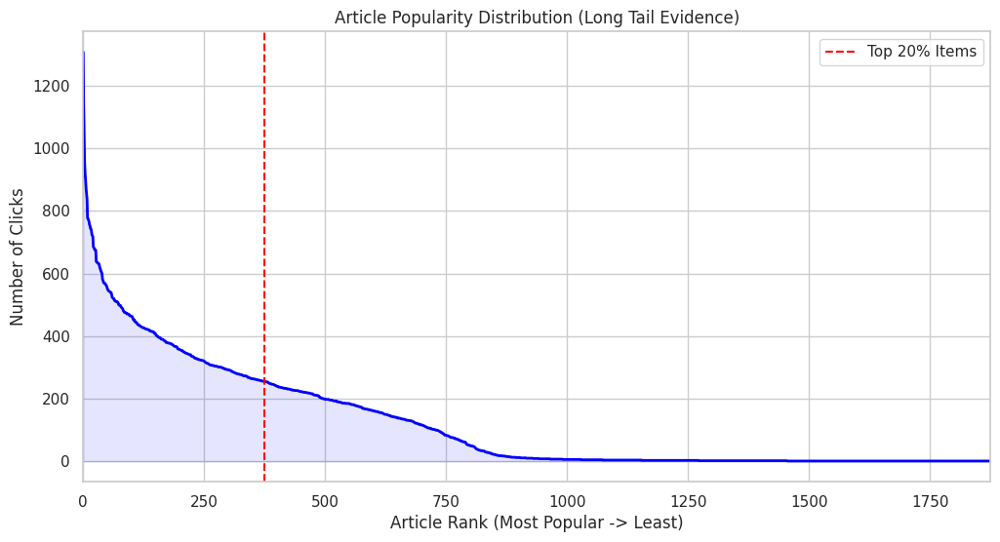
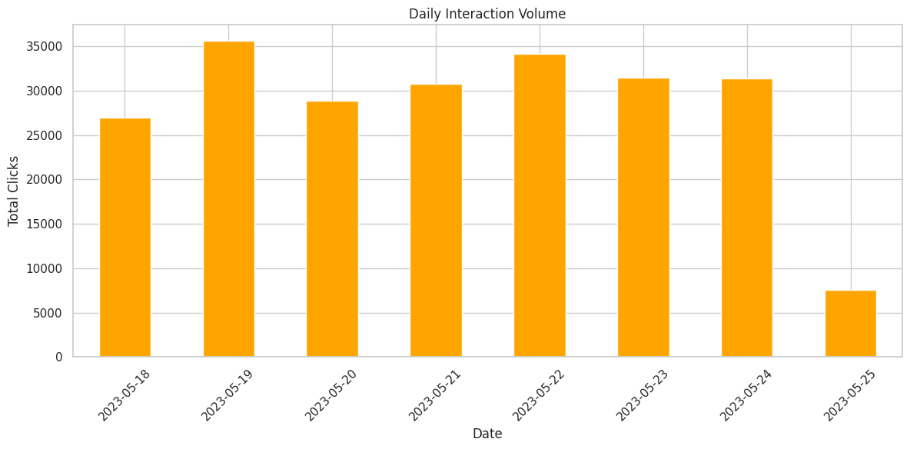
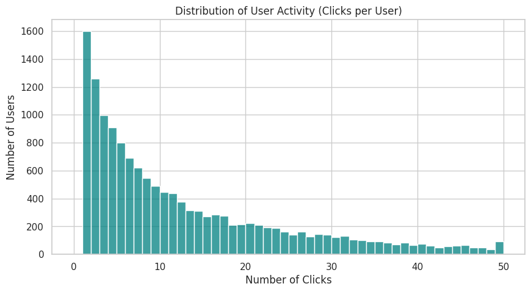
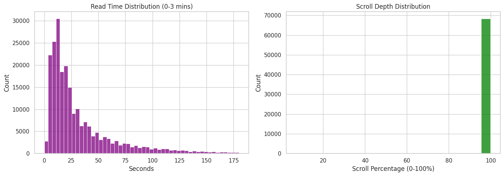

# News Recommendation Analysis with EB-NeRD  
**CSCE 676: Data Mining — Spring 2026**  
**Checkpoint 1 — Dataset Selection + Exploratory Data Analysis (EDA)**

This repository contains the work for **Checkpoint 1** of the course project.  
The goal of this checkpoint is to understand the **EB-NeRD** dataset and extract insights that affect **news recommendation** (bias, user behavior, engagement, and temporal patterns).

---

## Table of Contents
- [Project Overview](#project-overview)
- [Dataset](#dataset)
- [Repository Structure](#repository-structure)
- [Setup](#setup)
- [How to Run](#how-to-run)
- [EDA Results (with Figures)](#eda-results-with-figures)
- [Key Findings Summary](#key-findings-summary)
- [Notes / Assumptions](#notes--assumptions)
- [Next Steps](#next-steps)
- [Citation](#citation)

---

## Project Overview
News recommendation is challenging because:
- clicks follow a **long-tail / popularity bias**,
- many users have little history (**cold start**),
- engagement feedback (read time, scroll depth) is **skewed**,
- user activity changes over time (**temporal effects**).

In this checkpoint, we run EDA on EB-NeRD to quantify these issues and prepare for building recommenders in later checkpoints.

---

## Dataset
**Dataset:** EB-NeRD (Ekstra Bladet News Recommendation Dataset)

### Expected path used in notebook
Place the dataset parquet file here (same path assumed in the notebook):

```text
data/train/behaviors.parquet
```
Note: The dataset is not included in this repo due to size / licensing constraints.

### Download instructions
1. Download EB-NeRD from the official source provided by the authors / course.
2. Unzip it locally.
3. Create the folder structure:
   ```
   data/
   └── train/
       └── behaviors.parquet
   ```
4. Run the notebook.

---

## Repository Structure
```
.
├── Project Checkpoint 1.ipynb
├── README.md
└── assets/
    └── figures/
        ├── popularity_longtail.png
        ├── daily_interaction_volume.png
        ├── user_activity_clicks_per_user.png
        ├── read_time_distribution.png
        └── scroll_depth_distribution.png
```

---

## Setup
### Option A: Quick install (minimum)
```bash
pip install pandas numpy matplotlib seaborn pyarrow
```

### Option B: Recommended (virtual environment)
```bash
python -m venv .venv
source .venv/bin/activate     # Windows: .venv\Scripts\activate
pip install pandas numpy matplotlib seaborn pyarrow
```

---

## How to Run

### Google Colab
1. Upload the dataset file into the Colab workspace so it exists at: `data/train/behaviors.parquet`
2. Open `Project Checkpoint 1.ipynb`
3. Run all cells from top to bottom.

### Local (Jupyter)
```bash
pip install notebook
jupyter notebook
```
Open `Project Checkpoint 1.ipynb` and run all cells.

---

## EDA Results (with Figures)

### 1) Article Popularity Distribution (Long Tail Evidence)


**What this shows:**  
The graph shows the click frequency for articles. The curve drops sharply, indicating that a very small percentage of articles receive the majority of clicks, while most articles get very few.

**Why it matters:**  
This extreme **long-tail distribution** means that popularity-based baselines will be strong but biased. Recommender models need to be careful not to just recommend the "head" (popular items) and ignore the "tail" (niche items), which makes personalization harder.

### 2) Daily Interaction Volume


**What this shows:**  
This plot tracks the total number of user interactions (clicks/impressions) per day over the dataset's timespan.

**Why it matters:**  
News consumption is not static; it fluctuates by day of the week and breaking news events. This suggests that **time-based splitting** (training on past days, testing on future days) is crucial for realistic evaluation. It also highlights the need for models to handle **temporal dynamics**.

### 3) Distribution of User Activity (Clicks per User)


**What this shows:**  
This histogram displays how many clicks individual users perform. The distribution is heavily skewed to the right.

**Why it matters:**  
Most users have very few interactions (1-2 clicks), creating a significant **cold-start problem**. Models cannot rely solely on collaborative filtering (history-based) methods for these users and must leverage content features or popularity/recency baselines.

### 4) Engagement Signals: Read Time


**What this shows:**  
The distribution of time users spend reading articles. It is skewed similarly to the other metrics, with many short sessions and fewer long deep-dives.

**Why it matters:**  
**Read time** is a strong implicit signal of satisfaction. A click with a 5-second read time is less valuable than a 2-minute read. We can use this to weight our training samples (e.g., negative sampling short clicks) to optimize for engagement rather than just click-through rate (CTR).

### 5) Engagement Signals: Scroll Depth


**What this shows:**  
This shows how far down the page users scroll when reading an article.

**Why it matters:**  
**Scroll depth** is another proxy for interest. High scroll depth indicates the user consumed the content. Combined with read time, this helps filter out "accidental" or "low-quality" clicks, improving the quality of the data fed into the recommender system.

---

## Key Findings Summary
- **Popularity Bias:** Strong long-tail behavior in clicks (few articles dominate).
- **User Activity:** Many users have little history → cold-start is significant.
- **Engagement:** Read-time and scroll-depth distributions are skewed but useful for implicit feedback.
- **Temporal Effects:** Daily interaction volume varies → time-based evaluation is important.

---

## Notes / Assumptions
- Dataset files are not committed to GitHub.
- All figures are generated from the EDA notebook and stored in `assets/figures/`.
- Some columns may contain missing values; cleaning decisions are documented in the notebook.

---

## Next Steps
- Implement baselines: MostPopular, Recency
- Use time-based splits for evaluation
- Evaluate with ranking metrics: NDCG@K, HR@K, MRR
- Explore debiasing / reranking strategies to reduce popularity bias

---

## Citation
If you use EB-NeRD, cite the dataset / paper according to course and dataset author requirements.
