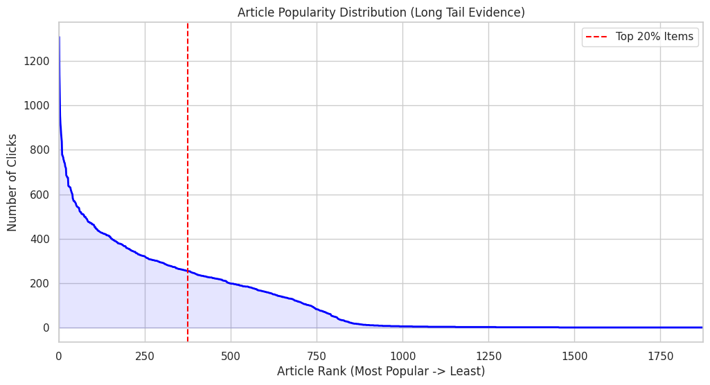
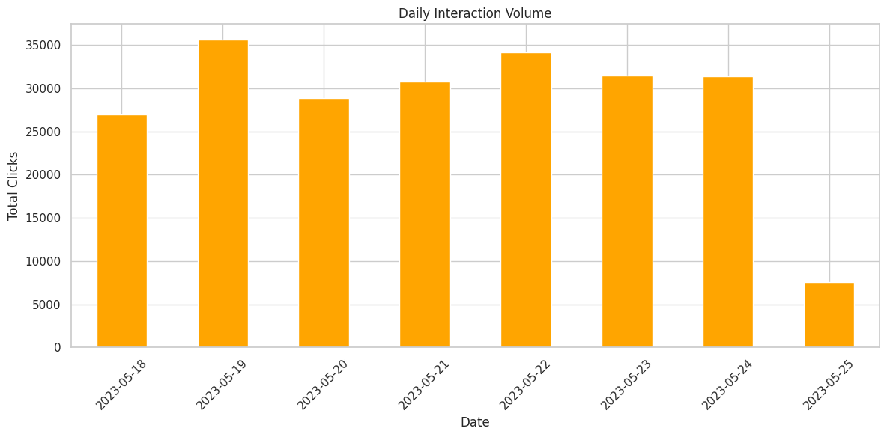
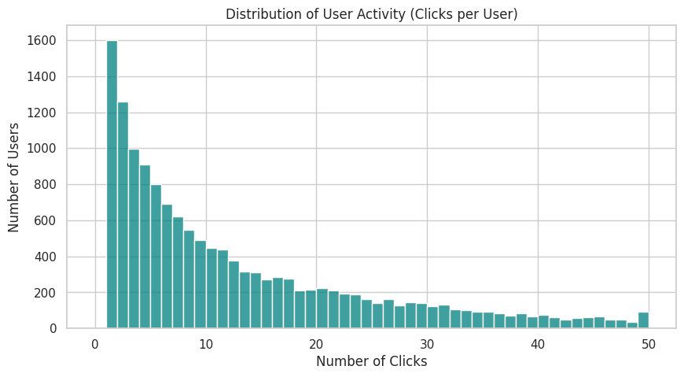
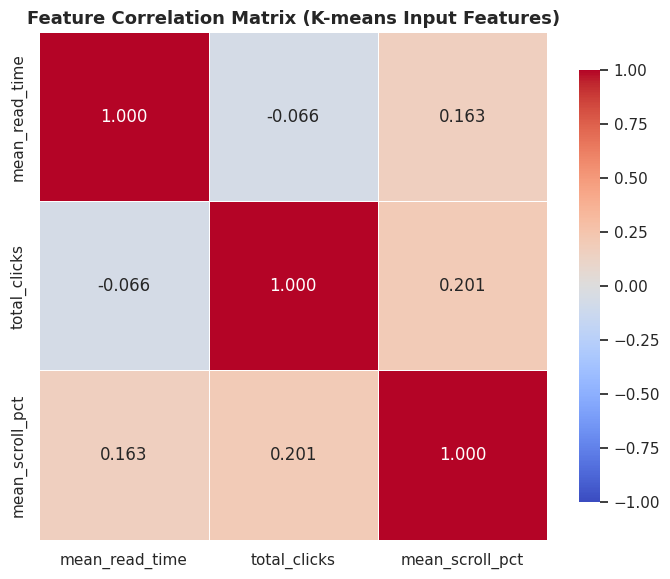
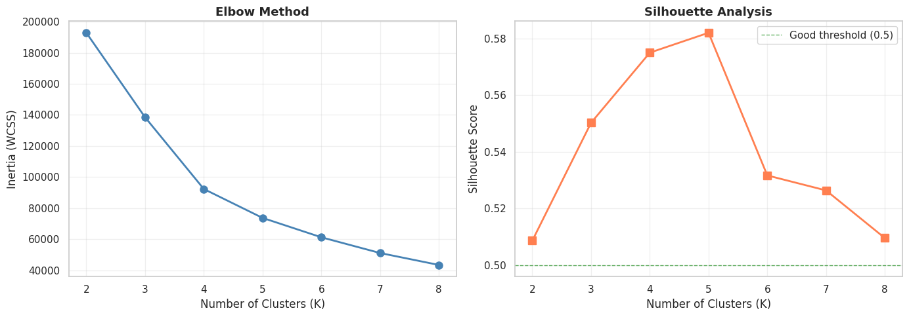
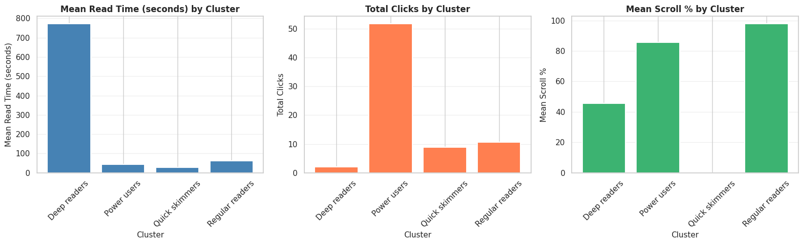
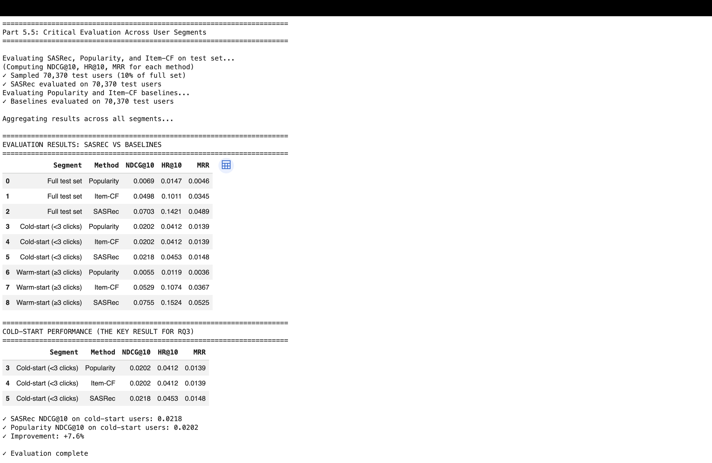
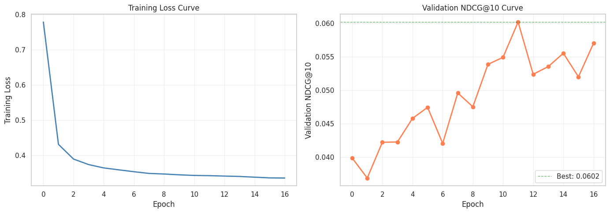
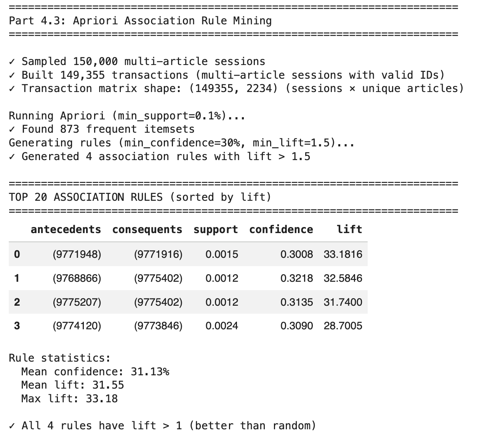

# Three Problems, Three Methods: A Sequential News Recommendation System

## 1) Overview

Modern news recommendation is harder than “rank what’s popular.” Real readers are **heterogeneous** (from casual browsers to deep readers), consumption is **sequential** (threaded exploration across articles), and a meaningful slice of traffic is **cold-start** (little to no history). This project builds a practical, story-driven recommendation pipeline on the **EB‑NeRD** dataset that treats these as *three distinct problems*—and shows why **one algorithm cannot solve all three well**. The key contribution is the **composition**: segment users by engagement, mine order-aware reading patterns, and route sparse-history users to a sequential deep model designed for short interaction traces.

## 2) Start Here

👉 **Start here:** **[`main_notebook.ipynb`](main_notebook.ipynb)**

## 3) Project Video

🎥 **Project video:** https://www.youtube.com/watch?v=ua6LKzbVGfk

## 4) Inside the Notebook: What You'll Find

The main notebook is organized as a guided project story, not just a collection of code cells. It starts with the motivation and dataset, then moves through three research questions, and ends by combining the results into one unified recommendation pipeline.

| Section | What It Covers |
|---|---|
| **Section 1** | Executive summary of the project, approach, and headline results |
| **Section 2** | Motivation, EB-NeRD dataset description, cleaning, and research questions |
| **Section 3** | RQ1: User segmentation using K-Means clustering |
| **Section 4** | RQ2: Sequential pattern mining using Apriori and PrefixSpan |
| **Section 5** | RQ3: Cold-start recommendation using SASRec |
| **Section 6** | Cross-RQ synthesis and unified recommendation pipeline |
| **Section 7** | Limitations of the current analysis |
| **Section 8** | Final conclusion and project takeaways |
| **Section 9** | Collaboration declaration and references |
| **Section 10** | Environment export and reproducibility step |

The recommended reading path is to start with `main_notebook.ipynb`, then review the checkpoint notebooks only if you want to see how the project evolved over the semester.

## 5) Research questions

**RQ1 — User heterogeneity:** Do users cluster into interpretable engagement tiers (e.g., skimmers vs deep readers), and can those tiers guide what “good recommendations” should prioritize?

**RQ2 — Sequential reading:** How often do sessions follow multi-article reading trails, and what *order-aware* patterns predict the next article better than unordered co-occurrence rules?

**RQ3 — Cold-start:** For users with extremely short histories, can a Transformer-based sequential recommender outperform simple baselines by extracting signal from minimal evidence?

## 6) Data (EB‑NeRD)

- **Dataset**: EB‑NeRD (Ekstra Bladet News Recommendation Dataset), released for the ACM RecSys Challenge
- **Download**: `https://recsys.acm.org/recsys24/challenge/`
- **Preprocessing**: remove **reads < 5 seconds** (about **2.7%** of raw interactions) to reduce bounce noise

**Placement instructions**

- **Colab**: upload the parquet so it exists at `/content/behaviors.parquet`
- **Local**: place at `data/train/behaviors.parquet`

See `data/README.md` for the exact expected layout.


*Figure: Clicks follow a strong long-tail—popularity is a powerful baseline, but also a major bias source (Gini quantified below).*

## 7) How to reproduce (Google Colab)

This project was developed and run in **Google Colab**.

1. **Open** `main_notebook.ipynb` in Colab.
2. **Upload data** to `/content/behaviors.parquet`.
3. **Install dependencies** using the pinned environment in `requirements.txt` at the repo root:

   ```bash
   pip install -r requirements.txt
   ```

   (In Colab, run `!pip install -r requirements.txt` in a cell.)
4. **Run** `main_notebook.ipynb` from **top to bottom**. This notebook contains the full curated narrative, analyses, figures, and evaluation.

Checkpoint notebooks **`checkpoints/checkpoint_1.ipynb`** and **`checkpoints/checkpoint_2.ipynb`** are retained to document **project progression** (how the work evolved from exploration to the final pipeline). They are **not required** before the deliverable notebook and **do not need** to be executed for grading or reproducibility if you rely on `main_notebook.ipynb`.


*Figure: Interaction volume varies over time, reinforcing the need for realistic evaluation and time-aware thinking in news recommendation.*

## 8) Key dependencies & versions

The table below lists the main libraries used in the project. Exact pinned versions are available in `requirements.txt`.

| Package | Version | Purpose |
|---|---:|---|
| Python | 3.11 / Colab runtime | Runtime environment |
| pandas | 2.2.2 | Data manipulation |
| numpy | 2.0.2 | Numerical computing |
| scikit-learn | 1.6.1 | K-Means, scaling, evaluation metrics |
| matplotlib | 3.10.0 | Plotting |
| seaborn | 0.13.2 | Statistical visualization |
| mlxtend | 0.23.4 | Apriori and association rules |
| prefixspan | 0.5.2 | Sequential pattern mining |
| pyarrow | 18.1.0 | Reading parquet files |
| torch | 2.10.0+cu128 | SASRec deep learning model |

The full pinned environment is captured in `requirements.txt` at the repository root.

## 9) Repo structure

```text
News-Rec-EBNeRD/
├── main_notebook.ipynb
├── requirements.txt
├── README.md
├── .gitignore
├── checkpoints/
│   ├── checkpoint_1.ipynb
│   └── checkpoint_2.ipynb
├── data/
│   └── README.md
└── assets/
    └── figures/
        ├── popularity_longtail.png
        ├── user_activity_clicks_per_user.png
        ├── daily_interaction_volume.png
        ├── read_time_distribution.png
        ├── scroll_depth_distribution.png
        ├── correlation_matrix.png
        ├── kmeans_elbow_silhouette.png
        ├── cluster_profiles_bars.png
        ├── cluster_pca_scatter.png
        ├── apriori_rules.png
        ├── sasrec_training_curves.png
        └── sasrec_evaluation.png
```

## 10) Results summary

- **11.7M** cleaned interactions across **787K** users  
- **44.1%** of sessions contain **multi-article sequences**  
- **19.1%** of users are **cold-start** \((<3 clicks)\)  
- **K-means** finds **5** user tiers with **silhouette = 0.58**  
- **Gini = 0.69**, confirming **strong popularity bias**  

The big takeaway is that EB‑NeRD is a **high-bias, high-sparsity, sequence-heavy** environment: readers differ sharply in engagement, many sessions contain meaningful multi-step trails, and a large cold-start segment limits history-based methods. The practical insight is that the strongest approach is **not a single model**, but a **composed system** that routes users to the method best matched to the evidence available (tier + sequence + history length). Full analysis and evaluation live in `main_notebook.ipynb`.


*Figure: Engagement is highly skewed—many users have very short histories, motivating cold-start handling and tier-aware modeling.*


*Figure: Behavioral signals (clicks, read time, scroll depth) carry complementary information—useful for segmentation rather than relying on clicks alone.*


*Figure: Clustering diagnostics supporting \(k=5\) engagement tiers with silhouette 0.58.*


*Figure: Interpretable engagement tiers—useful for thinking about different recommendation objectives (novelty vs reliability vs depth).*


*Figure: Co-occurrence rules capture “read-together” behavior but ignore direction; this motivates order-aware sequence mining (PrefixSpan).*


*Figure: SASRec training behavior on sequential click traces—used as the cold-start path when histories are too short for stable collaborative signals.*


*Figure: Comparative evaluation summary used to assess the cold-start recommendation approach (see notebook for metrics and setup).*

## 11) Checkpoint progression

Checkpoint 1 (`checkpoints/checkpoint_1.ipynb`) documents early exploration: popularity bias, user heterogeneity, and sequential-session behavior—establishing what a credible recommendation setting looks like on EB‑NeRD. Checkpoint 2 (`checkpoints/checkpoint_2.ipynb`) records feasibility prototyping and methodological choices toward segmentation, pattern mining, and sequential modeling.

The **`main_notebook.ipynb`** deliverable distills these steps into one coherent narrative. The checkpoints remain in the repository as transparency for how the work evolved across the semester; they complement the main notebook without defining a mandatory execution sequence for readers.

## Collaboration Declaration

**Project:** Final Deliverable, EB-NeRD News Recommendation System  
**Course:** CSCE 676, Data Mining, Spring 2026  
**Student:** Soumyadip Sarkar  
**Date:** April 27, 2026  

### Collaborators

None. This was completed as an individual project.

### AI Tools Used

| Tool | Used for |
|---|---|
| Google Gemini | Debugging notebook errors, checking pandas syntax, and reviewing metric interpretation |
| ChatGPT | Explaining recommendation methods, improving notebook structure, debugging Python code, and polishing markdown explanations |
| GitHub Copilot | Autocompleting Python, pandas, sklearn, and PyTorch code snippets |
| Claude | Reviewing notebook flow, improving written explanations, and cleaning markdown formatting |

## Limitations & Future Work

- **Offline-only evaluation**: ranking metrics on held-out data don’t replace online A/B tests or real user feedback loops.
- **Temporal dynamics**: topic drift and recency effects are critical in news; a production system should model freshness and time-aware behavior explicitly.
- **Cold-start remains hard**: users with 0–2 clicks have extremely limited signal; hybrid strategies (content, context, popularity-with-constraints) are still needed.
- **Clustering assumptions**: K-means favors roughly spherical clusters; alternative models (GMM, density-based) may capture irregular behavior better.
- **Pattern mining coverage**: frequent pattern methods can miss rare-but-important trails; scaling and sampling choices matter for recall.
- **Content understanding**: this work primarily uses behavioral traces; adding text/topic embeddings and entity signals could improve personalization and robustness.

## References

[1] Ekstra Bladet News Recommendation Dataset, EB-NeRD. RecSys 2024 Challenge. https://recsys.acm.org/recsys24/challenge/

[2] Kang, W.-C., and McAuley, J. (2018). Self-Attentive Sequential Recommendation. ICDM 2018. https://arxiv.org/abs/1808.09781

[3] Sun, F., Liu, J., Wu, J., Pei, C., Lin, X., Ou, W., and Jiang, P. (2019). BERT4Rec. CIKM 2019. https://arxiv.org/abs/1904.06690

[4] Agrawal, R., and Srikant, R. (1994). Fast Algorithms for Mining Association Rules. VLDB 1994.

[5] Pei, J., Han, J., Mortazavi-Asl, B., Pinto, H., Chen, Q., Dayal, U., and Hsu, M.-C. (2001). PrefixSpan. ICDE 2001.

[6] Aggarwal, C. C. (2016). Recommender Systems: The Textbook. Springer.

[7] Tan, P.-N., Steinbach, M., and Kumar, V. (2005). Introduction to Data Mining. Pearson.

CSCE 676 (Data Mining), Texas A&M University — Spring 2026
